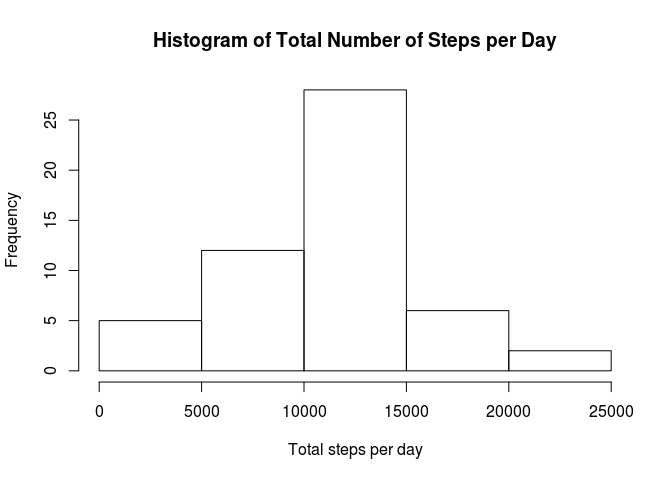
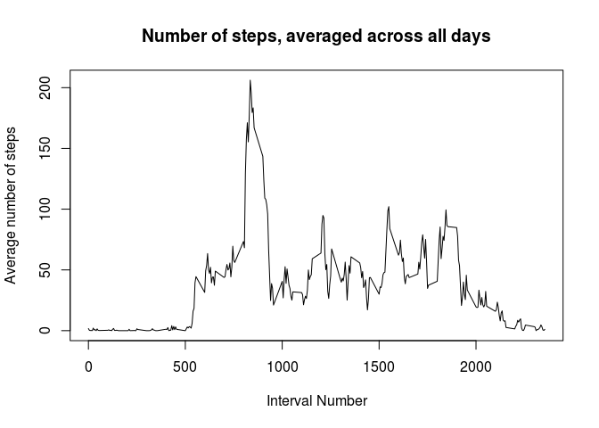
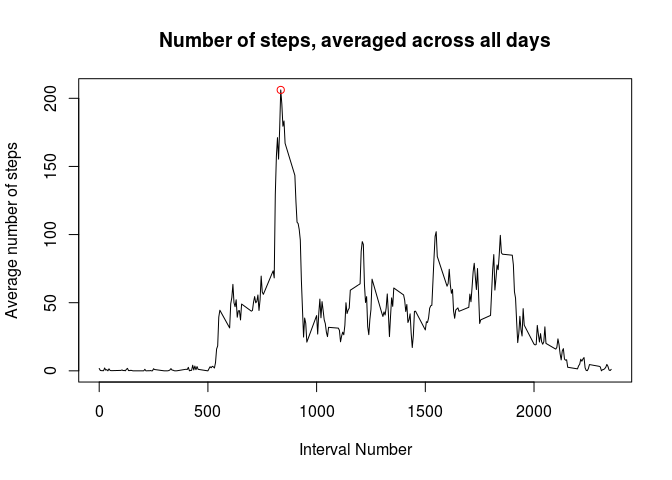
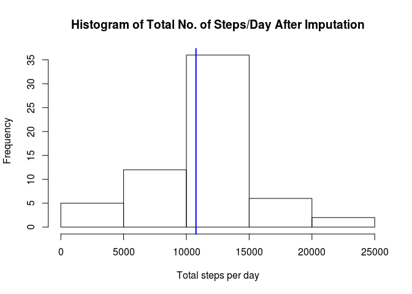
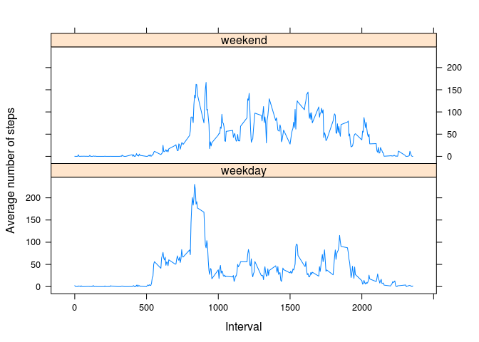

# Reproducible Research: Peer Assessment 1


## Loading and preprocessing the data
The data consists of two months of measurements from an anonymous individual collected during the months of October and November 2012, and include the number of steps taken in 5 minute intervals each day.
Assuming the archived data set is in the current directory, unzip and load with `read.csv` into data frame *rawData*. Since the *date* column is of class factor and not date, make the conversion to `Date` format.

```r
system("unzip activity.zip")
rawData <- read.csv("activity.csv")
sapply(rawData, class)
```

```
##     steps      date  interval 
## "integer"  "factor" "integer"
```

```r
rawData$date <- as.Date(as.character(rawData$date))
sapply(rawData, class)
```

```
##     steps      date  interval 
## "integer"    "Date" "integer"
```


## What is mean total number of steps taken per day?
First, compute the total number of steps per day. Two methods are presented below.

```r
# Method 1
total_per_day <- tapply(rawData$steps, rawData$date, sum)
# Method 2
library(plyr)
df <- data.frame(date = rawData$date, steps = rawData$steps)
total_per_day <- ddply(df, .(date), summarize, sum = sum(steps))
```
Plot a histogram of the total number of steps taken each day, to get an idea about the distribution of the data. Notice that the distribution is not quite symmetric and we expect the median to be slightly lower than the mean.

```r
hist(total_per_day$sum,xlab = "Total steps per day", main = "Histogram of Total Number of Steps per Day")
```

 

Finally, calculate the mean and median of the total number of steps taken per day.

```r
mean(total_per_day$sum, na.rm = TRUE)
```

```
## [1] 10766.19
```

```r
median(total_per_day$sum, na.rm = TRUE)
```

```
## [1] 10765
```


## What is the average daily activity pattern?
For this question, use `ddply` to calculate the number of steps corresponding to each 5-min interval, averaged across all days in the data set. The results are stored in *avgSteps* data frame; the first few rows are shown.

```r
avgSteps <- ddply(rawData, .(interval), summarize, avgSteps = mean(steps, na.rm =TRUE))
head(avgSteps)
```

```
##   interval  avgSteps
## 1        0 1.7169811
## 2        5 0.3396226
## 3       10 0.1320755
## 4       15 0.1509434
## 5       20 0.0754717
## 6       25 2.0943396
```
Construct a time series plot of the 5-minute interval (x-axis) and the average number of steps taken, averaged across all days (y-axis). As expected, the average number of steps is lower for intervals lower than 500 (5am), and beyond 2000 (8pm), when the person was either asleep or gravitating around the sofa at home.  

```r
plot(avgSteps$interval,avgSteps$avgSteps, type = "l", xlab = "Interval Number", 
     ylab = "Average number of steps", main = "Number of steps, averaged across all days")
```

 

Finally, determine the 5-min interval, on average across all the days in the dataset, which contains the maximum number of steps. As a bonus, display it on the time series plot.

```r
maxInterval <- avgSteps$interval[which.max(avgSteps$avgSteps)]
print(maxInterval)
```

```
## [1] 835
```

```r
plot(avgSteps$interval,avgSteps$avgSteps, type = "l", xlab = "Interval Number", 
     ylab = "Average number of steps",main = "Number of steps, averaged across all days")
par(new = T)
points(maxInterval, max(avgSteps$avgSteps), col = "red")
```

 

Notice the peak (8:35am) occurs in the morning, which may be the time when the person exercises.

## Imputing missing values
First, calculate and report the total number of missing values in the dataset (i.e. the total number of rows with NAs): 

```r
totalNA <- sum(is.na(rawData))
print(totalNA)
```

```
## [1] 2304
```

*Imputation strategy*. The imputation of the missing data is done by replacing the missing values for the number of steps with the mean for that 5-minute interval across all days, since it is already available. The row numbers corresponding to the missing values are stored in the *locateMissing* vector; for each one of these rows, the corresponding interval identifier is read from the *interval* column in *rawData*, and then located in the *avgSteps* data frame. Missing data in that particular row is imputed using the average value for the number of steps. Data set *myData* is created, equal to the original dataset, but with the missing data filled in.

```r
locateMissing <- which(is.na(rawData$steps))
myData <- rawData

for(ii in 1:totalNA) {
    # Find which interval corresponds to each row of missing data and then locate it in the 
    # avgSteps data frame. Replace the missing step value by the step value in the same row in 
    # avgStep. locateMissing[ii] is the row number for ii-th element in the NA list.
    whichInterval <- which( avgSteps$interval == rawData$interval[locateMissing[ii]])
    myData$steps[locateMissing[ii]] <- avgSteps$avgSteps[whichInterval] 
}
```
    
Make a histogram of the total number of steps taken each day and report the mean and median total number of steps taken per day. The median is shown in blue on the histogram. Notice that the value of the median now equals that of the mean. The imputation of the missing data on the estimates of the total daily number of steps has affected the distribution of the data (the median has changed). 

```r
total_per_day_after_imputation <- tapply(myData$steps, myData$date, sum)
hist(total_per_day_after_imputation,xlab = "Total steps per day", 
     main = "Histogram of Total No. of Steps/Day After Imputation")
abline(v = median(total_per_day_after_imputation), col = "blue", lwd = 2)
```

 

```r
mean(total_per_day_after_imputation)
```

```
## [1] 10766.19
```

```r
median(total_per_day_after_imputation)
```

```
## [1] 10766.19
```


## Are there differences in activity patterns between weekdays and weekends?
To differentiate between weekdays and weekends, first create a new factor variable in the dataset with two levels, "weekday" and "weekend", indicating whether a given date is a weekday or weekend day.

```r
myData$day <- ifelse(weekdays(myData$date) %in% c("Saturday", "Sunday"), "weekend","weekday")
myData <- transform(myData, day = factor(day))
head(myData)
```

```
##       steps       date interval     day
## 1 1.7169811 2012-10-01        0 weekday
## 2 0.3396226 2012-10-01        5 weekday
## 3 0.1320755 2012-10-01       10 weekday
## 4 0.1509434 2012-10-01       15 weekday
## 5 0.0754717 2012-10-01       20 weekday
## 6 2.0943396 2012-10-01       25 weekday
```

Make a panel plot containing a time series plot of the 5-minute interval (x-axis) and the average number of steps taken, averaged across all weekday days or weekend days (y-axis).

```r
myAvgSteps <- ddply(myData, .(interval, day), summarize, avgSteps = mean(steps))
library(lattice)
xyplot(avgSteps ~ interval | day, data = myAvgSteps, layout = c(1, 2), type ="l", 
       xlab = "Interval", ylab = "Average number of steps")
```

 

Notice there are differences between the two patterns, as expected: there are more local maxima throughout the day during weekends, indicating a higher activity level, as the person is not bound to an office chair.
